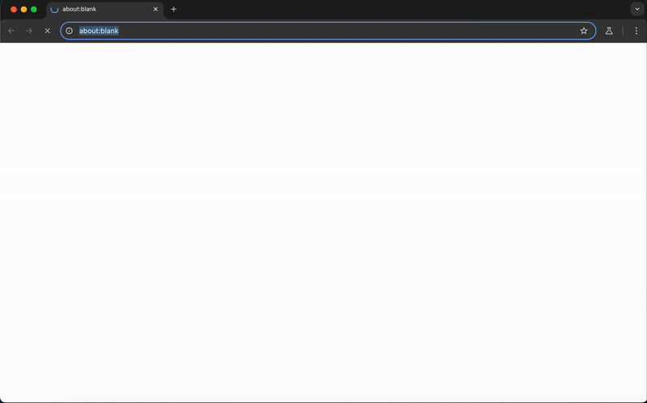

# RPA Challenge Automation with Python & Playwright

This repo includes my solution to the [RPA Challenge](https://rpachallenge.com/) as part of my application for the Python Automation Developer role at **Digital Workforce**.

The task was to automate a form that changes input field order over 10 rounds. I wanted to make the solution reliable, easy to read, and simple to run, whether locally or in Docker.

---

## Demo

Here’s a quick look at how it works:



---

##  Project Structure

```
rpa-challenge/
├── main.py                  # CLI entry point
├── src/
│   ├── form_automation.py   # Main automation logic
│   └── data_loader.py       # Excel reading and parsing
├── data/
│   └── challenge.xlsx       # Input file (Excel)
├── docker/
│   ├── Dockerfile           # Docker image
│   └── docker-compose.yaml  # Compose config
├── requirements.txt         # Python dependencies
└── README.md                # Project documentation
```


---

## Features

- Handles dynamic field order across all 10 rounds  
- Loads input data from Excel with `pandas`  
- `--headless` flag to run in background (no browser window)  
- `--fast` flag to enable performance mode with Python timer  
- Docker and Docker Compose support  
- Modular async code with Playwright  

---

## How to Run

### 1. Local (Python 3.10+)

```bash
pip install -r requirements.txt
python main.py                                    # Normal mode (visible browser)
```

--- 

### 2. Docker (no dependencies needed)

No Python or Playwright setup needed.\
Make sure Docker is installed and running, then:

```bash
cd docker/
docker compose up --build
```

After it's done, you'll see something like:

```bash
Python timer: 1213 ms

Your success rate is 100% ( 70 out of 70 fields) in 1244 milliseconds
```

To rebuild from scratch:

```bash
docker compose build --no-cache
```

---

## CLI Options

You can customize how the script runs using these flags:

- `--headless`: Runs the browser in headless mode (no visible window). Useful for speed and automation.
- `--fast`: Enables performance mode. This flag:
  - Automatically activates headless mode
  - Skips waiting for the final result screen
  - Prints the script execution time in milliseconds

### Example usage


Normal mode with visible browser and result screen

```bash
python main.py
```
  
Background mode (no UI), shows result at the end
```bash
python main.py --headless
```
 
Performance mode, no UI, shows Python timer, skips final result wait
```bash
python main.py --fast
```

---

## Design Decisions

- **Playwright over Selenium**  
  I chose Playwright for modern and fast automation with built-in async support. I’ve used it before and it fits this use case well.

- **Async / await structure**  
  I used async functions throughout to keep things clean and efficient. Not strictly required for a small script like this.

- **Dynamic label matching**  
  Since field order changes every round, I matched visible label text to spreadsheet headers for flexible input handling.

- **Excel input with `pandas`**  
  Maybe a bit much for this task, but it’s reliable and I already know how to use it well.

- **CLI flags (`--headless`, `--fast`) (bonus)**  
  Flags help switch between dev/debug and performance modes quickly. Useful for different testing situations.

- **Docker support (bonus)**  
  I built a container setup so anyone can run the project easily without worrying about local dependencies.

- **Modular structure**  
   I kept everything modular: loading data, filling forms and parsing CLI args are all in their own files, so it’s easy to understand or extend later.

---

## Final thoughts

I really enjoyed building this. It felt like a small *Hack The Box*-style puzzle. I couldn't rely on the same approach I've used in similar projects before.

More importantly I wanted the end result to feel like something I'd hand off to a teammate or a client.

So I focused on:

- Keeping the logic simple and robust  
- Avoiding hardcoded selectors  
- Adding comments to explain tricky parts  
- Making the setup easy (especially for people who just want to test it fast)
